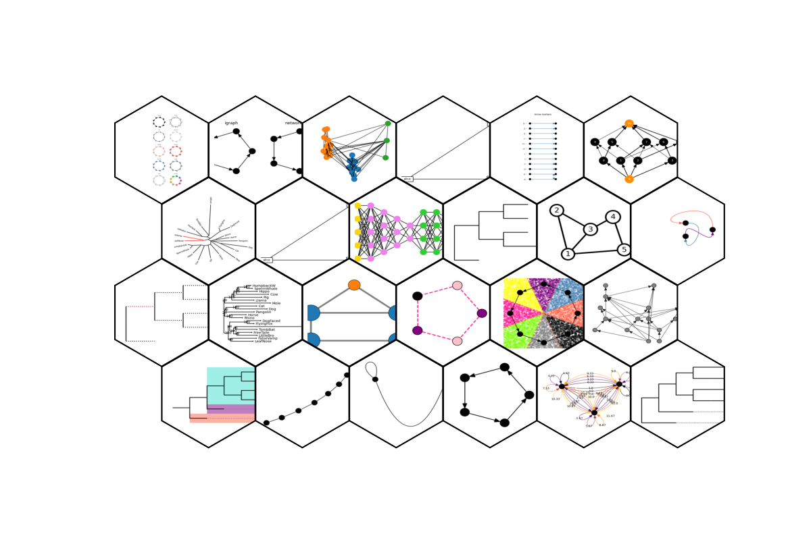

[](https://github.com/fabilab/iplotx/actions/workflows/test.yml)
[](https://pypi.org/project/iplotx/)
[](https://iplotx.readthedocs.io/en/latest/)
[](https://coveralls.io/github/fabilab/iplotx?branch=main)

[DOI](https://f1000research.com/articles/14-1377)


# iplotx
[](https://iplotx.readthedocs.io/en/latest/gallery/index.html).

Visualise networks and trees in Python, with style.

Supports:
- **networks**:
  - [networkx](https://networkx.org/)
  - [igraph](igraph.readthedocs.io/)
  - [graph-tool](https://graph-tool.skewed.de/)
  - [zero-dependency](https://iplotx.readthedocs.io/en/latest/gallery/plot_simplenetworkdataprovider.html#sphx-glr-gallery-plot-simplenetworkdataprovider-py)
- **trees**:
  - [ETE4](https://etetoolkit.github.io/ete/)
  - [cogent3](https://cogent3.org/)
  - [phyloframe](https://phyloframe.readthedocs.io)
  - [Biopython](https://biopython.org/)
  - [scikit-bio](https://scikit.bio)
  - [dendropy](https://jeetsukumaran.github.io/DendroPy/index.html)
  - [zero-dependency](https://iplotx.readthedocs.io/en/latest/gallery/tree/plot_simpletreedataprovider.html#sphx-glr-gallery-tree-plot-simpletreedataprovider-py)

In addition to the above, *any* network or tree analysis library can register an [entry point](https://iplotx.readthedocs.io/en/latest/providers.html#creating-a-custom-data-provider) to gain compatibility with `iplotx` with no intervention from our side.

## Installation
```bash
pip install iplotx
```

## Quick Start
```python
import networkx as nx
import matplotlib.pyplot as plt
import iplotx as ipx

g = nx.Graph([(0, 1), (1, 2), (2, 3), (3, 4), (4, 0)])
layout = nx.layout.circular_layout(g)
ipx.plot(g, layout)
```


## Documentation
See [documentation](https://iplotx.readthedocs.io/en/latest/) and [gallery](https://iplotx.readthedocs.io/en/latest/gallery/index.html).

## Citation
If you use `iplotx` for publication figures, please cite:

```
F. Zanini. A universal tool for visualisation of networks and trees in Python. F1000Research 2025, 14:1377. https://doi.org/10.12688/f1000research.173131.1
```

## Features
- Plot networks from multiple libraries including networkx, igraph and graph-tool, using Matplotlib. ✅
- Plot trees from multiple libraries such as cogent3, ETE4, phyloframe, skbio, biopython, and dendropy. ✅
- Flexible yet easy styling, including an internal library of styles ✅
- Interactive plotting, e.g. zooming and panning after the plot is created. ✅
- Store the plot to disk in many formats (SVG, PNG, PDF, GIF, etc.). ✅
- 3D network visualisation with depth shading. ✅
- Efficient plotting of large graphs (up to ~1 million nodes on a laptop). ✅
- Edit plotting elements after the plot is created, e.g. changing node colors, labels, etc. ✅
- Animations, e.g. showing the evolution of a network over time. ✅
- Mouse and keyboard interaction, e.g. hovering over nodes/edges to get information about them. ✅
- Node clustering and covers, e.g. showing communities in a network. ✅
- Edge tension, edge waypoints, and edge ports. ✅
- Choice of tree layouts and orientations. ✅
- Tree-specific options: cascades, subtree styling, split edges, etc. ✅
- (WIP) Support uni- and bi-directional communication between graph object and plot object.🏗️

## Authors
Fabio Zanini (https://fabilab.org)
