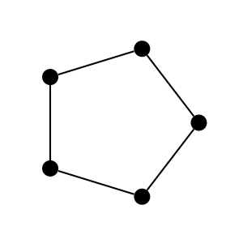

# iplotx documentation

`iplotx` is a Python library to display graphs or networks using `matplotlib` as a backend. It supports multiple network analysis libraries (currently `networkx` and `igraph`). Independently of what library you used to make your graphs and layouts, `iplotx` guarantees the **exact same visual appearance**.

## Installation
```
pip install iplotx
```


## Quick Start
::::{tab-set}

:::{tab-item} igraph

```
import igraph as ig
import matplotlib.pyplot as plt
import iplotx as ipx

g = ig.Graph.Ring(5)
layout = g.layout("circle").coords
fig, ax = plt.subplots(figsize=(3, 3))
ipx.plot(g, ax=ax, layout=layout)
```


:::

:::{tab-item} networkx
```
import networkx as nx
import matplotlib.pyplot as plt
import iplotx as ipx

g = nx.Graph([(0, 1), (1, 2), (2, 3), (3, 4), (4, 0)])
layout = nx.layout.circular_layout(g)
fig, ax = plt.subplots(figsize=(3, 3))
ipx.plot(g, ax=ax, layout=layout)
```

:::

::::

Either way, the result is the same:



## Gallery
See <project:gallery/index.rst> for examples of plots made with `iplotx`. Feel free to suggest new examples on GitHub by opening a new issue or pull request!

## Styles
`iplotx` is designed to produce publication-quality figures using **styles**, which are dictionaries specifying the visual properties of each graph element, including vertices, edges, arrows, labels, and groupings.

An example of style specification is as follows:

```python
import iplotx as ipx
with ipx.style.context({
    'vertex': {
        'size': 30,
        'facecolor': 'red',
        'edgecolor': 'none',
    }
}):
    ipx.plot(...)
```

See <project:style.md> for more info.

## Rationale
We believe graph **analysis**, graph **layouting**, and graph **visualisation** to be three separate tasks. `iplotx` currently focuses on visualisation. It might expand towards layouting in the future.

```{toctree}
:maxdepth: 2
:caption: Contents

style
gallery/index
```
